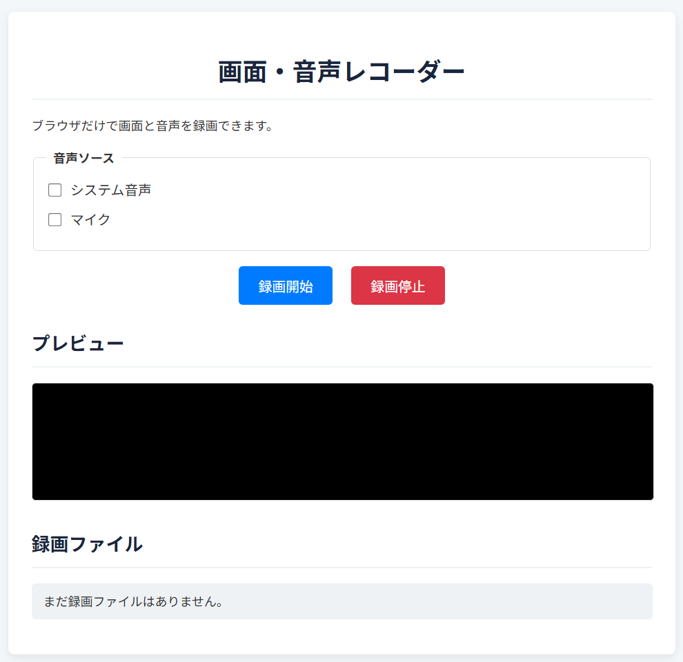

# スクリーン録画アプリ

これはシンプルなスクリーン録画を行うWebアプリケーションです。  
**UIイメージ**


## 概要

このWebアプリは、GoogleのGemini CLIを用いて開発されました。開発者は一行もコードを書いていません。
`prompt.txt`に、開発時の指示内容がすべて記録されています。

## 使い方

専門的な知識は不要です。以下の手順で誰でも簡単に利用できます。

1. このリポジトリをGitHubからダウンロードします。
2. ダウンロードしたZIPファイルをすべて展開（解凍）します。
3. 展開したフォルダの中にある `index.html` ファイルをダブルクリックしてブラウザで開きます。

## 各ファイルの役割

| ファイル名 | 役割 |
| :--- | :--- |
| `index.html` | Webページの骨格となるファイルです。画面の要素やレイアウトを定義しています。 |
| `style.css` | Webページの見た目を整えるためのファイルです。色やフォント、配置などを指定します。 |
| `script.js` | アプリケーションの動作を記述するファイルです。画面録画の機能やボタンの操作などが含まれます。 |
| `prompt.txt` | このアプリを生成するためにGemini CLIに与えた指示（プロンプト）を記録したファイルです。 |


## プロンプト

以下は、このアプリケーションを生成するためにGemini CLIに与えられた実際のプロンプトです。

```text
ローカルで動くwebアプリを作成してください。画面録画および、音声をシステム音声とデバイスマイクから取得した音声も録音できるようにしたいです。また音声については、どの音声を録音に使うか、例えば、システムのみやマイクのみ、どちらもなど選択できるようにしてください。画面についても選択できるようにしてください。
```
